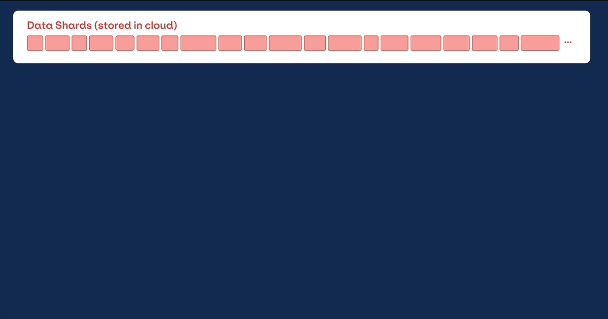
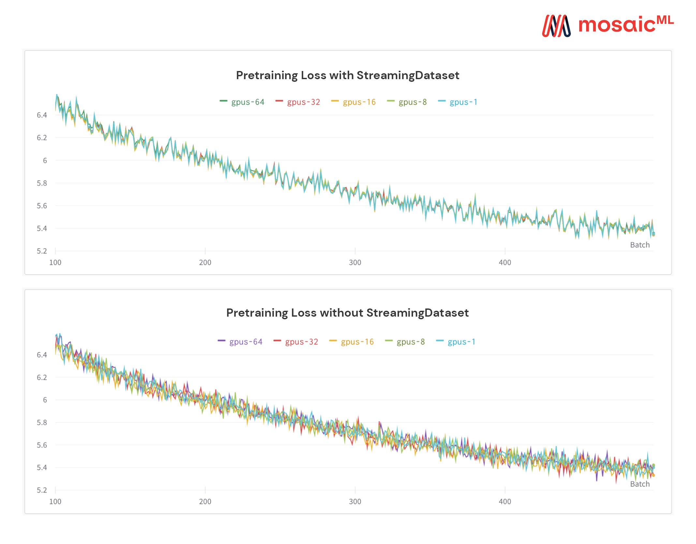
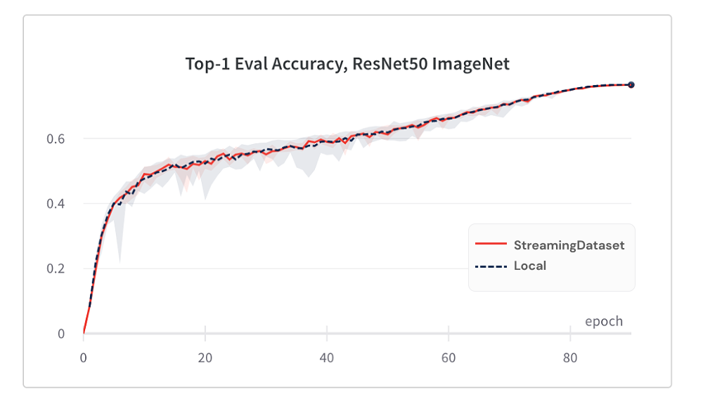

<br />
<p align="center">
    <a href="https://github.com/mosaicml/streaming#gh-light-mode-only" class="only-light">
      
    </a>
    <!--pypi website does not support dark mode and does not understand GitHub tag. Hence, it renders both the images.
    The below tag is being used to remove the dark mode image on pypi website.-->
    <!-- SETUPTOOLS_LONG_DESCRIPTION_HIDE_BEGIN -->
    <a href="https://github.com/mosaicml/streaming#gh-dark-mode-only" class="only-dark">
      
    </a>
    <!-- SETUPTOOLS_LONG_DESCRIPTION_HIDE_END -->
</p>

<h2><p align="center">Fast, accurate streaming of training data from cloud storage</p></h2>

<h4><p align='center'>
<a href="https://www.mosaicml.com">[Website]</a>
- <a href="https://streaming.docs.mosaicml.com/en/latest/getting_started/user_guide.html">[Getting Started]</a>
- <a href="https://streaming.docs.mosaicml.com/">[Docs]
- <a href="https://www.mosaicml.com/team">[We're Hiring!]</a>
</p></h4>

<p align="center">
    <a href="https://pypi.org/project/mosaicml-streaming/">
        
    </a>
    <a href="https://pypi.org/project/mosaicml-streaming/">
        
    </a>
    <a href="https://github.com/mosaicml/streaming/actions?query=workflow%3ATest">
        
    </a>
    <a href="https://pypi.org/project/mosaicml-streaming/">
        
    </a>
    <a href="https://streaming.docs.mosaicml.com">
        
    </a>
    <a href="https://join.slack.com/t/mosaicml-community/shared_invite/zt-w0tiddn9-WGTlRpfjcO9J5jyrMub1dg">
        
    </a>
    <a href="https://github.com/mosaicml/streaming/blob/main/LICENSE">
        
    </a>
</p>
<br />

# 👋 Welcome

We built StreamingDataset to make training on large datasets from cloud storage as fast, cheap, and scalable as possible.

It’s specially designed for multi-node, distributed training for large models—maximizing correctness guarantees, performance, and ease of use. Now, you can efficiently train anywhere, independent of your training data location. Just stream in the data you need, when you need it. To learn more about why we built StreamingDataset, read our [announcement blog.](https://www.notion.so/f8b1634eb0de470db25fda47f83a0884)

StreamingDataset is compatible with any data type, including **images, text, video, and multimodal data**.

With support for major cloud storage providers ([AWS](https://aws.amazon.com/s3/), [OCI](https://www.oracle.com/cloud/storage/object-storage/), and [GCS](https://cloud.google.com/storage) are supported today; [Azure](https://azure.microsoft.com/en-us/products/storage/blobs) is coming soon), and designed as a drop-in replacement for your PyTorch [IterableDataset](https://pytorch.org/docs/stable/data.html#torch.utils.data.IterableDataset) class, StreamingDataset seamlessly integrates into your existing training workflows.



# 🚀 Getting Started

## 💾 Installation

Streaming can be installed with `pip`:

<!--pytest.mark.skip-->
```bash
pip install mosaicml-streaming
```

## 🏁 Quick Start

### 1. Prepare Your Data

Convert your raw dataset into one of our supported streaming formats:

- MDS (Mosaic Data Shard) format which can encode and decode any Python object
- CSV / TSV
- JSONL

<!--pytest.mark.skip-->
```python
import numpy as np
from PIL import Image
from streaming import MDSWriter

# Directory in which to store the compressed output files
data_dir = 'path-to-dataset'

# A dictionary mapping input fields to their data types
columns = {
    'image': 'jpeg',
    'class': 'int'
}

# Shard compression, if any
compression = 'zstd'

# Save the samples as shards using MDSWriter
with MDSWriter(data_dir, columns, compression) as out:
    for i in range(10000):
        sample = {
            'image': Image.fromarray(np.random.randint(0, 256, (32, 32, 3), np.uint8)),
            'class': np.random.randint(10),
        }
        out.write(sample)
```

### 2. Upload Your Data to Cloud Storage

Upload your streaming dataset to the cloud storage of your choice ([AWS](https://aws.amazon.com/s3/), [OCI](https://www.oracle.com/cloud/storage/object-storage/), or [GCP](https://cloud.google.com/storage)). Below is one example of uploading a directory to an S3 bucket using the [AWS CLI](https://aws.amazon.com/cli/).

<!--pytest.mark.skip-->
```bash
$ aws s3 cp --recursive path-to-dataset s3://my-bucket/path-to-dataset
```

### 3. Build a StreamingDataset and DataLoader

<!--pytest.mark.skip-->
```python
from torch.utils.data import DataLoader
from streaming import StreamingDataset

# Remote path where full dataset is persistently stored
remote = 's3://my-bucket/path-to-dataset'

# Local working dir where dataset is cached during operation
local = '/tmp/path-to-dataset'

# Create streaming dataset
dataset = StreamingDataset(local, remote, shuffle=True)

# Let's see what is in sample #1337...
sample = dataset[1337]
img = sample['image']
cls = sample['class']

# Create PyTorch DataLoader
dataloader = DataLoader(dataset)
```

### 📚 What next?

Getting started guides, examples, API references, and other useful information can be found in our [docs](https://streaming.docs.mosaicml.com/).

We have end-to-end tutorials for training a model on:

- [CIFAR-10](https://streaming.docs.mosaicml.com/en/stable/examples/cifar10.html)
- [FaceSynthetics](https://streaming.docs.mosaicml.com/en/stable/examples/facesynthetics.html)
- [SyntheticNLP](https://streaming.docs.mosaicml.com/en/stable/examples/synthetic_nlp.html)

We also have starter code for the following popular datasets, which can be found in the `streaming` [directory](https://github.com/mosaicml/streaming/tree/main/streaming):

| Dataset | Task | Read | Write |
| --- | --- | --- | --- |
| LAION-400M | Text and image | [Read](https://github.com/mosaicml/diffusion-benchmark/blob/main/data.py) | [Write](https://github.com/mosaicml/streaming/tree/main/streaming/multimodal/convert/laion/laion400m) |
| WebVid | Text and video | [Read](https://github.com/mosaicml/streaming/blob/main/streaming/multimodal/webvid.py) | [Write](https://github.com/mosaicml/streaming/blob/main/streaming/multimodal/convert/webvid.py) |
| C4 | Text | [Read](https://github.com/mosaicml/streaming/blob/main/streaming/text/c4.py) | [Write](https://github.com/mosaicml/streaming/blob/main/streaming/text/convert/c4.py) |
| EnWiki | Text | [Read](https://github.com/mosaicml/streaming/blob/main/streaming/text/enwiki.py) | [Write](https://github.com/mosaicml/streaming/tree/main/streaming/text/convert/enwiki) |
| Pile | Text | [Read](https://github.com/mosaicml/streaming/blob/main/streaming/text/pile.py) | [Write](https://github.com/mosaicml/streaming/blob/main/streaming/text/convert/pile.py)
| ADE20K | Image segmentation | [Read](https://github.com/mosaicml/streaming/blob/main/streaming/vision/ade20k.py) | [Write](https://github.com/mosaicml/streaming/blob/main/streaming/vision/convert/ade20k.py)
| CIFAR10 | Image classification | [Read](https://github.com/mosaicml/streaming/blob/main/streaming/vision/cifar10.py) | [Write](https://github.com/mosaicml/streaming/blob/main/streaming/vision/convert/cifar10.py) |
| COCO | Image classification | [Read](https://github.com/mosaicml/streaming/blob/main/streaming/vision/coco.py) | [Write](https://github.com/mosaicml/streaming/blob/main/streaming/vision/convert/coco.py) |
| ImageNet | Image classification | [Read](https://github.com/mosaicml/streaming/blob/main/streaming/vision/imagenet.py) | [Write](https://github.com/mosaicml/streaming/blob/main/streaming/vision/convert/imagenet.py) |

**To start training on these datasets:**

1. Convert raw data into .mds format using the corresponding script from the `convert` directory.

For example:

<!--pytest.mark.skip-->
```bash
$ python -m streaming.multimodal.convert.webvid --in <CSV file> --out <MDS output directory>
```

2. Import dataset class to start training the model.

<!--pytest.mark.skip-->
```python
dataset = StreamingWebVid(local, remote, shuffle=True)
```

# **🔑** Key Features

---

## True Determinism

A unique feature of our solution: samples are in the same order regardless of the number of GPUs, nodes, or CPU workers. This makes it easier to:

- Reproduce and debug training runs and loss spikes
- Load a checkpoint trained on 64 GPUs and debug on 8 GPUs with reproducibility

See the figure below — training a model on 1, 8, 16, 32, or 64 GPUs yields the **exact same loss curve** (up to the limitations of floating point math!)



## Instant Mid-Epoch Resumption

It can be expensive — and annoying — to wait for your job to resume while your dataloader spins after a hardware failure or loss spike. Thanks to our deterministic sample ordering, StreamingDataset lets you resume training in seconds, not hours, in the middle of a long training run.

Minimizing resumption latency can save thousands of dollars in egress fees and idle GPU compute time compared to existing solutions.

## High throughput

Our MDS format cuts extraneous work to the bone, resulting in ultra-low sample latency and higher throughput compared to alternatives for workloads bottlenecked by the dataloader.

| Tool | Throughput |
| --- | --- |
| StreamingDataset | ~19000 img/sec |
| ImageFolder | ~18000 img/sec |
| WebDataset | ~16000 img/sec |

*Results shown are from ImageNet + ResNet-50 training, collected over 5 repetitions after the data is cached after the first epoch.*

## Equal Convergence

Model convergence from using StreamingDataset is just as good as using local disk, thanks to our shuffling algorithm.



Below are results from ImageNet + ResNet-50 training, collected over 5 repetitions.

| Tool | Top-1 Accuracy |
| --- | --- |
| StreamingDataset | 76.51% +/- 0.09 |
| ImageFolder | 76.57% +/- 0.10 |
| WebDataset | 76.23% +/- 0.17 |

StreamingDataset shuffles across all samples assigned to a node, whereas alternative solutions only shuffle samples in a smaller pool (within a single process). Shuffling across a wider pool spreads out adjacent samples more. In addition, our shuffling algorithm minimizes dropped samples. We have found both of these shuffling features advantageous for model convergence.

## Random access

Access the data you need when you need it.

Even if a sample isn’t downloaded yet, you can access `dataset[i]` to get sample `i`. The download will kick off immediately and the result will be returned when it’s done - similar to a map-style PyTorch dataset with samples numbered sequentially and accessible in any order.

<!--pytest.mark.skip-->
```python
dataset = StreamingDataset(...)
sample = dataset[19543]
```

## **No divisibility requirements**

StreamingDataset will happily iterate over any number of samples. You do not have to forever delete samples so that the dataset is divisible over a baked-in number of devices. Instead, each epoch a different selection of samples are repeated (none dropped) so that each device processes the same count.

<!--pytest.mark.skip-->
```python
dataset = StreamingDataset(...)
dl = DataLoader(dataset, num_workers=...)
```

# 🏆 Project Showcase

Here are some projects and experiments that used StreamingDataset. Got something to add?  Email [community@mosaicml.com](https://www.notion.so/Marketing-Community-f18e033b62c844e2a5d271453feb558c) or join our [Community Slack](https://join.slack.com/t/mosaicml-community/shared_invite/zt-1btms90mc-GipE2ufuPkKY0QBrmF3LSA).

- [BioMedLM](https://www.mosaicml.com/blog/introducing-pubmed-gpt): a Domain Specific Large Language Model for BioMedicine by MosaicML and Stanford CRFM
- [Mosaic Diffusion Models](https://www.mosaicml.com/blog/training-stable-diffusion-from-scratch-costs-160k): Training Stable Diffusion from Scratch Costs <$160k
- [Mosaic LLMs](https://www.mosaicml.com/blog/gpt-3-quality-for-500k): GPT-3 quality for <$500k
- [Mosaic ResNet](https://www.mosaicml.com/blog/mosaic-resnet): Blazingly Fast Computer Vision Training with the Mosaic ResNet and Composer
- [Mosaic DeepLabv3](https://www.mosaicml.com/blog/mosaic-image-segmentation): 5x Faster Image Segmentation Training with MosaicML Recipes
- …more to come! Stay tuned!

# 💫 Contributors

We welcome any contributions, pull requests, or issues.

To start contributing, see our [Contributing](https://github.com/mosaicml/streaming/blob/main/CONTRIBUTING.md) page.

P.S.: [We're hiring](https://mosaicml.com/jobs)!

If you like this project, give us a star **⭐** and check out our other projects:

- **[Composer](https://github.com/mosaicml/composer) -** a modern PyTorch library that makes scalable, efficient neural network training easy
- **[MosaicML Examples](https://github.com/mosaicml/examples)** - reference examples for training ML models quickly and to high accuracy - featuring starter code for GPT / Large Language Models, Stable Diffusion, BERT, ResNet-50, and DeepLabV3
- **[MosaicML Cloud](https://www.mosaicml.com/cloud)** - our training platform built to minimize training costs for LLMs, Diffusion Models, and other large models - featuring multi-cloud orchestration, effortless multi-node scaling, and under-the-hood optimizations for speeding up training time

# ✍️ Citation

```
@misc{mosaicml2022streaming,
    author = {The Mosaic ML Team},
    title = {streaming},
    year = {2022},
    howpublished = {\\url{<https://github.com/mosaicml/streaming/>}},
}
```
