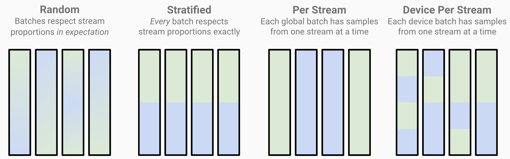

from matplotlib.artist import kwdoc

# Mixing Datasets

Training a model often requires combining data from multiple different sources. Streaming makes combining these data sources, or streams, easy and configurable. See the [main concepts page](../getting_started/main_concepts.md#distributed-model-training) for a high-level view of distributed training with multiple streams.

## Using Streams

A stream is a data source, as a collection of shard files (or set of subdirectories containing shard files). Shard files can optionally be compressed. Streams are represented by the {class}`streaming.Stream` object. Similar to {class}`streaming.StreamingDataset` itself, a `Stream` object can take in `remote` and `local` paths -- see [here](../getting_started/main_concepts.md#remote-data-streams) for an example.

It is possible, though not recommended, for streams to have different schemas.

### Registering a custom Stream implementation
You can also customize the implementation of a `Stream`. To modify the behavior of a `Stream` that is used in a `StreamingDataset`, you can subclass `Stream`, and register the subclass as shown in the below example without forking the library.

<!--pytest.mark.skip-->
```python
from streaming.base.stream import streams_registry

class MyStream(Stream):
    # your implementation goes here
    pass

# Register your custom stream class as 'my_stream'
streams_registry.register('my_stream', func=MyStream)

# StreamingDataset creates a MyStream object when 'my_stream' is passed as a stream_name
dataset = StreamingDataset(
    remote='s3://some/path',
    local='/local/path',
    stream_name='my_stream',
    stream_config={'arg1': 'val1'},
)
```

See more methods for registering custom Stream classes in [this README section of LLM Foundry](https://github.com/mosaicml/llm-foundry/tree/3269c7399add8ca30842edbeb83d0c82f7906726?tab=readme-ov-file#how-to-register).

## Configuring the data mix
The `proportion`, `repeat`, or `choose` arguments to `Stream` are used to configure different dataset mixing schemes. Only one of them may be set at a time, and all streams must use the same mixing scheme (e.g., Stream A with `proportion` and Stream B with `choose` are incompatible).
- **`proportion`**: Specifies how to sample this Stream relative to other Streams.
- **`repeat`**: Specifies the degree to which a Stream is upsampled or downsampled.
- **`choose`**: Specifies the number of samples to choose from a Stream.

Let's look at some examples of dataset mixing in action.

### Using `proportion` for relative weighting

As an example, let's say we have Stream A with 100 samples and Stream B with 200 samples. The `epoch_size`, if not set, will default to the total number of unique samples -- in this case, 300. To configure our training dataset to be 25% from Stream A and 75% from Stream B, we simply set `proportion` to those values:
<!--pytest.mark.skip-->
```python
stream_A = Stream(
    remote = 's3://stream_A_remote',
    local = '/tmp/stream_A',
    proportion = 0.25,
)
stream_B = Stream(
    remote = 's3://stream_B_remote',
    local = '/tmp/stream_B',
    proportion = 0.75,
)
dataset = StreamingDataset(
    streams = [stream_A, stream_B],
)
```

Since `epoch_size` has not been specified, the epoch will be 300 samples long, of which 75 samples will come from Stream A, and 225 from Stream B. Equivalently, we could have also set `proportion` to 2 for Stream A and 6 for Stream B for the same weighting -- StreamingDataset will normalize the proportion weights.

If `epoch_size` is explicitly set, then proportions will apply to that value instead. For example, if `epoch_size` was passed as 400 to StreamingDataset, as below, and proportions stayed the same, then in each epoch, 100 samples would be from Stream A and 300 would be from Stream B.
<!--pytest.mark.skip-->
```python
dataset = StreamingDataset(
    epoch_size = 400,
    streams = [stream_A, stream_B],    # With proportions A: 0.25 and B: 0.75.
)
```

For multi-epoch training, to control how samples are chosen between epochs, see the [inter-epoch sampling](replication_and_sampling.md#inter-epoch-sampling) section.

### Using `repeat` for absolute weighting

It can be useful to specify how many times to upsample or downsample a Stream -- the `repeat` argument fulfills this use case. For example, to see every sample from Stream A 3 times per epoch, simply set `repeat` to 3:
<!--pytest.mark.skip-->
```python
stream_A = Stream(
    remote = 's3://stream_A_remote',
    local = '/tmp/stream_A',
    repeat = 3,
)
```

To downsample a stream, meaning that only a fraction of the total samples from that stream are seen every epoch, set `repeat` to less than 1. For example, to see only a quarter of the samples from Stream A per epoch, set `repeat` to 0.25.

### Using `choose` for absolute weighting

Specifying the absolute number of samples to choose from a Stream can also be useful when mixing datasets. Use the `choose` argument to indicate the number of samples to take from a stream per epoch. For example, to see exactly 250 samples from Stream A per epoch, set `choose` to 250:
<!--pytest.mark.skip-->
```python
stream_A = Stream(
    remote = 's3://stream_A_remote',
    local = '/tmp/stream_A',
    choose = 250,
)
```

## Batching Methods

Controlling how a global batch is constructed is a requirement for some training runs. StreamingDataset's `batching_method` argument takes in three different options to configure the composition of each global batch:
- **`'random'`**: (default) Global batches respect dataset mixing *in expectation*. Stream proportions can vary somewhat between batches.
- **`'stratified'`**: *Every* global batch respects dataset mixing exactly. Can help mitigate loss spikes and divergence by making sure stream proportions hold for every batch.
- **`'per_stream'`**: Each global batch contains samples from only one stream at a time. Particularly useful when your streams contain data of different tensor shapes/sizes, so that each batch can contain samples of the same shape/size.
- **`'device_per_stream'`**: Each *device* batch contains samples from only one stream at a time. Like `per_stream`, this is useful when mixing data from streams with different tensor shapes/sizes. Crucially, by mixing at the device batch level, each global batch can still contain samples from multiple streams.

As an example, suppose we have Stream A (green) and Stream B (blue), each making up half of our total dataset. Applying each of the batching methods would make global batches look like this:



Each bar represents a single global batch. We see that `random` batching can have some variance in stream composition, while `stratified` batching keeps composition exact, and `per_stream` batching constructs each batch with a single stream.
