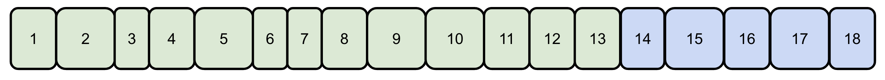
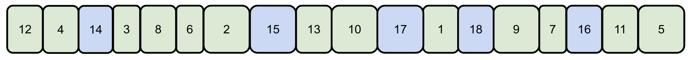
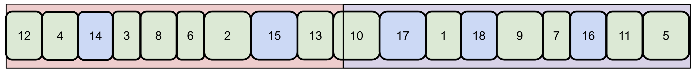
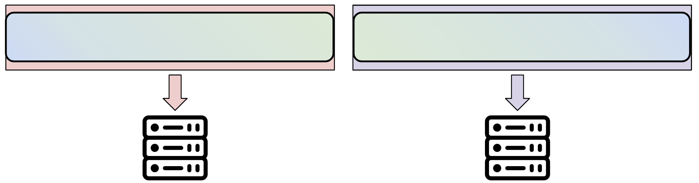
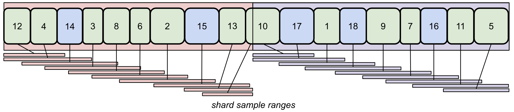
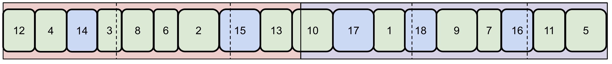

# Shuffling

Shuffling is important for model convergence during training, but can be computationally expensive. Unshuffled data can lead to divergence, loss spikes, or suboptimal training. Streaming's shuffling is made to give you great shuffle quality without sacrificing training throughput. Shuffling depends on 5 different arguments, shown below. **StreamingDataset's defaults ensure high shuffle quality and throughput, so merely setting `shuffle=True` is performant in nearly all cases.**

| Parameter | Type | Default value | Description |
| :-------- | :--- | :------------ | :---------- |
| `shuffle` | `bool` | `False` | turn shuffling on or off |
| `shuffle_algo` | `str` | `'py1e'` | which shuffling algorithm to use |
| `shuffle_seed` | `int` | `9176` | all randomness in StreamingDataset is derived from this seed |
| `shuffle_block_size` | `int` | `max(4000000/num_canonical_nodes, 1<<18)` | Number of samples to shuffle at a time, only used by py1b, py1br, and py1e algorithms |
| `num_canonical_nodes` | `int` | # of physical nodes | Number of sample buckets. Controls shuffling in py1s and py2s algorithms |

## How Shuffling Works

**Step 1**: StreamingDataset downloads shard metadata contained in `index.json` files and partitions sample IDs among nodes, devices, and workers. Shards and samples are not shuffled. See the [main concepts page](../getting_started/main_concepts.md#distributed-model-training) for more information. Below, we have two streams, or data sources, in green and blue. Each stream is a collection of shards, which are numbered.

**Step 2**: The shard order is shuffled.

**Step 3**: Shards are split over canonical nodes, which are simply buckets of samples. The `num_canonical_nodes` parameter controls how many of these buckets there are. Some shards can be split between canonical nodes. There are two canonical nodes shown here, in pink and purple.

**Step 4**: Samples are shuffled within each canonical node, to maximize performance and reduce inter-node shard downloads. Canonical nodes are then assigned to physical training nodes. Now, the sample IDs are shuffled and ready for training. The `shuffle_algo` parameter controls how this shuffling hapens.

## Shuffling Algorithms

The `shuffle_algo` can be set to one of five choices, each with different tradeoffs. We recommend the default shuffle algorithm, `py1e`, as it achieves great shuffle quality while balancing shard downloads.

### Shuffle-block-based algorithms

If your dataset has not been pre-shuffled, or you are using multiple streams, you should use a shuffle-block-based algorithm. The `py1e`, `py1br`, and `py1b` shuffles use the `shuffle_block_size` parameter, which determines how many samples within each canonical node are shuffled at once. You should set `shuffle_block_size` to be larger than the number of samples in a single shard (usually, at least 10x) for a high quality shuffle.

#### `'py1e'` (default)

Samples from each shard are spread out across a range of maximum size `shuffle_block_size`. The diagram below shows how the samples from each shard are spread out over a specified range, shuffling them.

This algorithm provides great shuffle quality, just like `py1br` and `py1b`, while also reducing the maximum needed cache limit and better balancing shard downloads. StreamingDataset defaults to using this shuffling algorithm.

#### `'py1br'`

Samples within each canonical node are shuffled in blocks of size `shuffle_block_size`. The block sizes are slightly randomized. The diagram below shows the boundaries of each shuffle block as a dashed line.

This algorithm is a more download-optimal version of `py1b`, which is being deprecated.

#### `'py1b'`

This algorithm is very similar to `py1br`, without randomizing shuffle block sizes, resulting in suboptimal download performance. It will soon be deprecated -- please use `py1e` or `py1br` instead.

### Intra-shard shuffle algorithms

If your dataset has been pre-shuffled, your cache limit per node is very small, or if just having a lightweight shuffle is okay for your training run, use an intra-shard shuffle algorithm. These shuffling algorithms only require storing one shard per canonical node at a time during training, resulting in very low disk usage.

#### `'py1s'`

Samples within each shard or shard part are shuffled. The `py1s` algorithm only performs shuffling once, *after* shards are split among canonical nodes, in contrast to `py2s`.

#### `'py2s'`

Samples within each shard are shuffled both before and after shards are split among canonical nodes. This corresponds to an additional shuffle before Step 3 above. The `py2s` shuffle results in a higher quality shuffle for shards that are split between two canonical nodes, but requires two shuffles, in contrast to `py1s`. As a result, it is more computationally expensive.

### Naive shuffling

#### `'naive'`

Globally shuffles all samples. This is useful for single-node training on small data, where you want the most random shuffle possible, but is the least download-efficient of all shuffle algorithms. Training throughput is often much lower when using the `naive` shuffling algorithm.

If you are having trouble with throughput and shuffle quality, please refer to the [perfomance tuning page](../distributed_training/performance_tuning.md).

