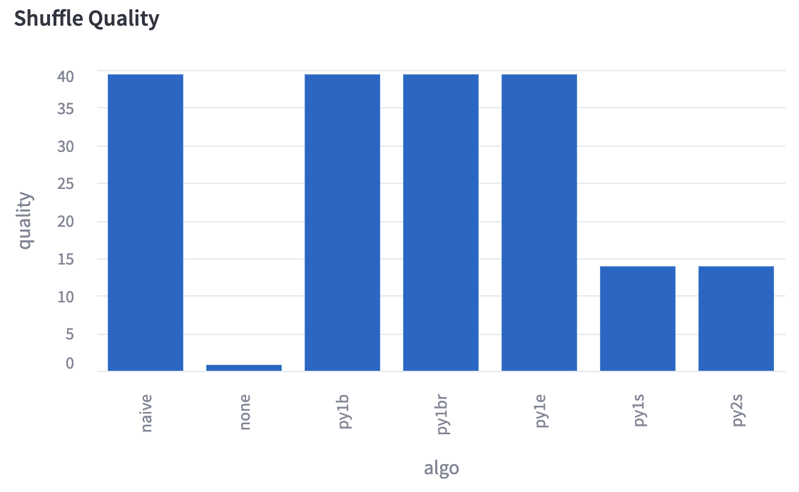

# Performance Tuning

Getting the best performance from your training jobs is of utmost importance -- GPUs are expensive! Streaming's default parameters give great performance out-of-the-box for most model configurations. Performance with Streaming mainly deals with downloading and storing shards optimally.

Great performance with Streaming means that dataloading is never a bottleneck during model training. Streaming also provides the [Streaming Simulator tool](#streaming-simulator) to help with performance optimization. Let's dive in!

## Downloading shards

Streaming downloads dataset shards on the fly to make sure that the samples they contain are ready to be trained with. Refer to this [section](../dataset_configuration/shard_retrieval.md#controlling-shard-downloads) for information on how to control shard downloads. Some potential issues we have seen:
- The dataset `predownload` and dataloader `workers` are set too low. Either increase the `predownload` parameter to StreamingDataset, or increase the number of workers for your dataloader, to allow more samples to be prepared ahead of time.
- Shard downloads are not balanced, often in conjunction with low download bandwidth. To determine if shuffling is increasing download demand too much, try running with `shuffle` set to `False`. Then, make sure `shuffle_algo` is set to `'py1e'` (more info [here](../dataset_configuration/shuffling.md#py1e-default)) to help balance out inter- and intra-node shard downloads while maintaining shuffle quality. If this is still slowing down training, try the [`'py1s'`](../dataset_configuration/shuffling.md#py1s) or [`'py2s'`](../dataset_configuration/shuffling.md#py2s) shuffling algorithms.

## Storing shards

Once shards are downloaded, they are stored on each node's disk, and are available to that node's GPUs. Refer to this [section](../dataset_configuration/shard_retrieval.md#controlling-shard-downloads) for information on controlling how shards are stored. The main issue that can crop up here is when the node's available disk space is less than the cache size required to store dataset shards. Testing that :math:`a^2 + b^2 = c^2`, but then maybe $a^2 + b^2 = c^2$. If `cache_limit` is not set, each node's cache size for shards is given by:

.. math::

    L = \frac{S \cdot N}{P}


Where $L$ is the required cache limit per node, in MB, $S$ is the average shard size, in MB, $P$ is the number of physical nodes,  and $N$ is the total number of shard files. However, for optimal performance, the *minimum* required `cache_limit` can be much lower, since each node only needs to store shards that have samples that are actively being used for training. If `shuffle` is `False`, or if using the [`'py1s'`](../dataset_configuration/shuffling.md#py1s) or [`'py2s'`](../dataset_configuration/shuffling.md#py2s) shuffling algorithms, the required cache limit will be approximately:

$$L = 2 \cdot S \cdot \lceil\frac{C}{P}\rceil $$

Where $L$ is the required minimum cache limit per node, in MB, $S$ is the average shard size, in MB, $C$ is the number of canonical nodes (see [here](../dataset_configuration/shuffling.md#how-shuffling-works) and [here](../distributed_training/elastic_determinism.md#requirements)), and $P$ is the number of physical nodes. This is because only a single shard, plus a potentially predownloaded subsequent shard, needs to be resident per canonical node to make progress during training.

If using a shuffle-block-based algorithm such as [`'py1e'`](../dataset_configuration/shuffling.md#py1e-default), [`'py1br'`](../dataset_configuration/shuffling.md#py1br), or [`'py1b'`](../dataset_configuration/shuffling.md#py1b), the required minumum cache limit per node will be approximately:

$$L = k \cdot S \lceil \frac{B}{Q} \rceil \cdot \lceil\frac{C}{P}\rceil $$

Where $L$ is the required minimum cache limit per node, in MB, $k$ is a constant that depends on the shuffle algorithm used, $S$ is the average shard size, in MB, $B$ is the shuffle block size (see [here](../dataset_configuration/shuffling.md#shuffle-block-based-algorithms)) as a number of samples, $K$ is the average number of samples per shard, $C$ is the number of canonical nodes (sample buckets), and $P$ is the number of physical nodes. This is because each shuffle block consists of $\lceil \frac{B}{Q}\rceil$ shards, and the subsequent shuffle block's shards may have to be predownloaded. The constant $k$ is $1$ for the [`'py1e'`](../dataset_configuration/shuffling.md#py1e-default) algorithm, whereas it is $2$ for both [`'py1br'`](../dataset_configuration/shuffling.md#py1br) and [`'py1b'`](../dataset_configuration/shuffling.md#py1b), meaning that `'py1e'` gives better cache limit performance, while retaining shuffle quality.

# Streaming Simulator

A simulator for throughput, network use, and shuffle quality with MosaicML Streaming. The simulator allows you to:
- Plan runs and anticipate issues beforehand
- Find optimal run configurations
- Debug issues with underperforming runs
- Better understand the impact of different configurations

## Getting Started
Run the following to install simulator-specific dependencies, if they don't already exist:
```
pip install --upgrade "mosaicml-streaming[simulator]"
```
Then, simply run `simulator` in your command line to open the Web UI and get simulating!
## Key Features

### Throughput
Throughput is estimated for the duration of the run and is displayed as the simulation progresses. We estimate throughput by iterating over the samples of the dataset in order, and performing shard downloads based on an estimate of network bandwidth. The 10-step rolling average is displayed.


### Network Downloads
Cumulative network downloads are also estimated for the run and displayed. It is calculated in conjunction with throughput. If shards are compressed, we assume they are downloaded in compressed form and immediately uncompressed.


### Simulation Stats
We also provide various useful statistics from the simulation, such as:
- Minimum cache limit (i.e., maximum space used by live shards)
- Steps slowed down by shard downloads
- Estimated time to first batch
- Estimated warmup time (i.e., time until throughput maximized)


### Shuffle Quality
You can choose to evaluate the quality of different shuffling algorithms for your run. We provide an estimate of shuffle quality based on the entropy calculated over the probability distribution of differences between neighboring sample indices and shard indices of the dataset. *These shuffle quality metrics are noisy and may not reflect the true strength of a shuffle.*




### Yaml Support
Yaml files that follow MosaicML conventions can be uploaded and simulated as well. Simply click the toggle, enter any needed additional information, and see your results. Parameters can also be modified to quickly test out configurations.


