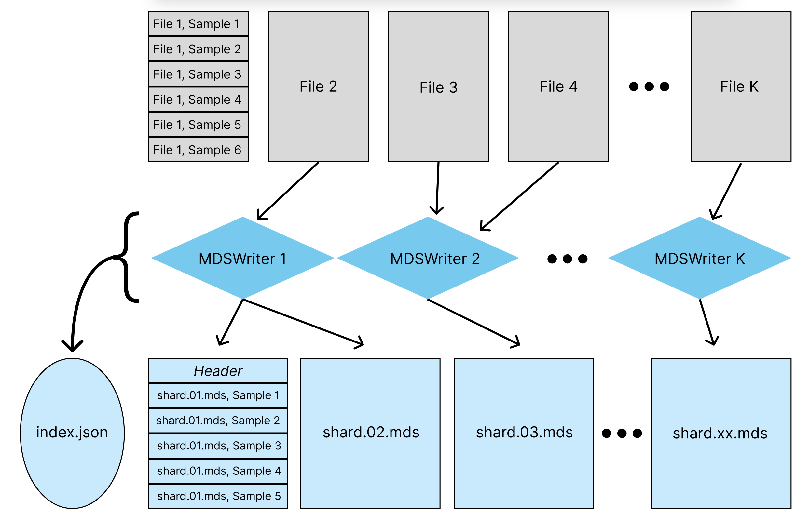
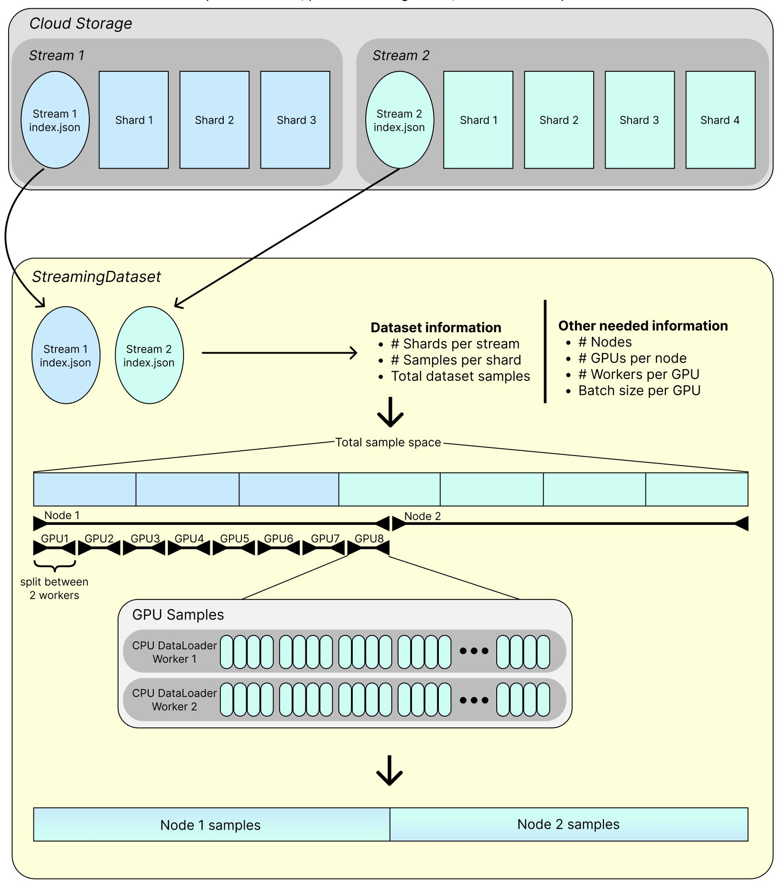
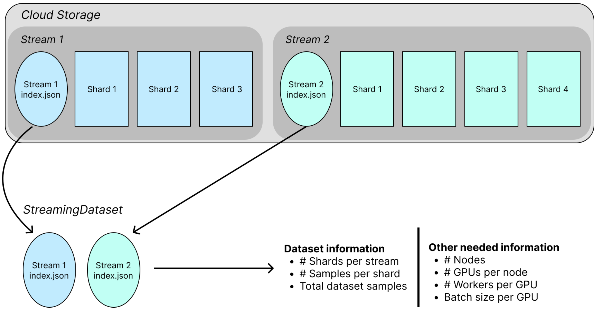
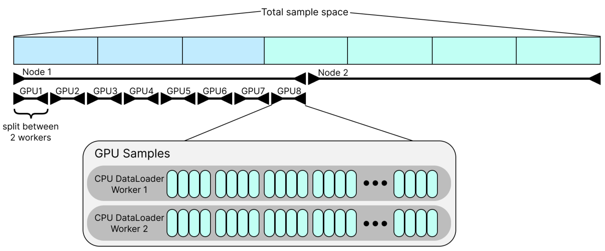
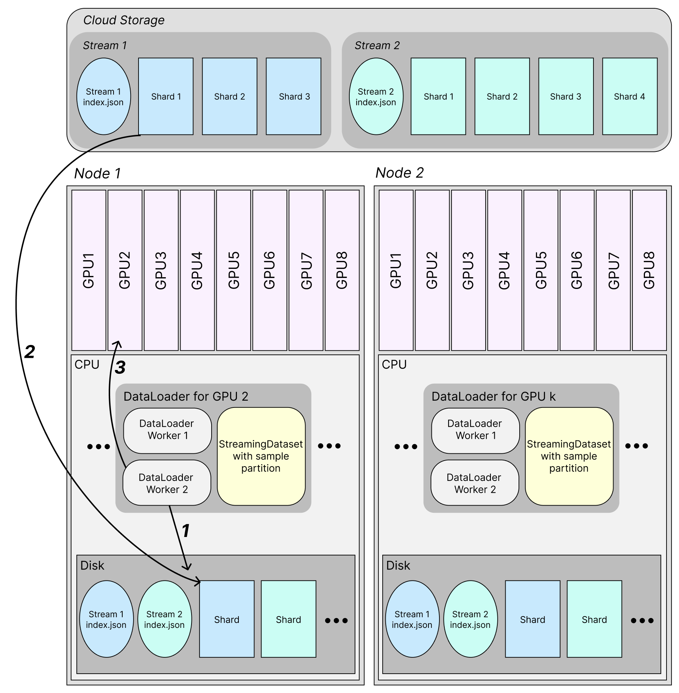

# 🧠 Main Concepts

## Overview
Training a model with Streaming happens in 2 main steps:
1. Convert your data to a StreamingDataset-compatible format
2. Distributed model training with StreamingDataset

Let's cover the key concepts in this process.

## Dataset conversion
Raw data samples need to be processed into a **stream**, or set of **shard** files, that allow for fast random access during training. Streaming supports the following file formats:
* MDS (most performant)
* CSV/TSV
* JSONL

A **shard** is a file, compatible with Streaming, that contains samples that are ready for training.

A **stream** is a collection of shard files.

The diagram below shows how raw data samples are converted to MDS shards using {class}`streaming.MDSWriter` objects.



`MDSWriter` objects take in original dataset samples and convert them binary MDS shards, which contain serialized samples. The mapping from original files to shard files is not strict and can be one-to-one, many-to-one, or one-to-many. Each shard has a header that allows for fast random access to every sample during model training.

As shown above, an `index.json` file is also created for the set of shard files, or stream, containing information such as the number of shards, number of samples per shard, shard sizes, etc. An example `index.json` file, which has metadata for multiple MDS shards, and where samples contain only one column called "tokens" encoded as `Bytes`, is structured as below:
<!--pytest.mark.skip-->
```json
{
    "shards": [
        {   // Shard 0
            "column_encodings": ["bytes"],
            "column_names": ["tokens"],
            "column_sizes": [null],
            "compression": null,
            "format": "mds",
            "hashes": [],
            "raw_data": {
                "basename": "shard.00000.mds",
                "bytes": 67092637,
                "hashes": {}
            },
            "samples": 4093,
            "size_limit": 67108864,
            "version": 2,
            "zip_data": null
        },
        {   // Shard 1, very similar to Shard 0 metadata
            ...
            "raw_data": {
                "basename": "shard.00001.mds",
                "bytes": 67092637,
                "hashes": {}
            },
            ...
        },
    // and so on
    ]
}
```

Below, we use `MDSWriter` to write out a stream to a remote location that contains integer columns `'x'` and `'y'` in each sample:
<!--pytest.mark.skip-->
```python
columns = {'x': 'int', 'y': 'int'}
output_dir = 's3://path/for/mds/dataset'
with MDSWriter(out=output_dir, columns=columns) as out:
    for sample in raw_dataset_iterator:
        out.write(sample)
```

Read more about dataset formats [here](../preparing_datasets/dataset_format.md), and about dataset conversion [here](../preparing_datasets/basic_dataset_conversion.md).

## Distributed model training
StreamingDataset splits up samples between nodes, ranks, and dataloader workers. Shards are downloaded, and samples retrieved from them, during distributed model training.

A **node** is a host CPU system with its own disk space, with multiple GPUs attached, typically 8.

A **rank** in this context is a specialized component for accelerated model training -- typically a GPU.

A **worker** is a process on CPU that handles fetching shards and samples. Assigned to a particular rank on a node.

### Start of training
StreamingDataset downloads the `index.json` files for input streams, and uses the information they contain to partition samples across nodes, ranks, and workers. The diagram below shows this process:



Let's understand what's happening here.

#### Remote data streams
The `index.json` files and shards for multiple streams are stored in the cloud. A Stream typically corresponds to one data source. The overall dataset combines samples from all input streams. Two streams are shown here, but StreamingDataset supports combining any number. Streams can be mixed in various [ways](../dataset_configuration/mixing_data_sources.md), making final dataset composition flexible.



Below, we pass in a list of {class}`streaming.Stream` objects to a {class}`streaming.StreamingDataset`, and also specify the proportion of the overall dataset we want to take from each stream.
<!--pytest.mark.skip-->
```python
# Stream 1 uses its own set of shard files and will be 1/4 of the training dataset.
stream_1 = Stream(
    remote = 's3://stream_1/directory',
    local = '/local/cache/stream_1',
    proportion = 0.25,
)
# Stream 2 is similar to above, but will be 3/4 of the training dataset.
stream_2 = Stream(
    remote = 's3://stream_2/directory',
    local = '/local/cache/stream_2',
    proportion = 0.75,
)

# This dataset uses multiple streams.
dataset = StreamingDataset(streams=[stream_1, stream_2], batch_size=4)
```

If using a single stream, we could just specify the `remote` and `local` locations directly instead:
<!--pytest.mark.skip-->
```python
dataset = StreamingDataset(remote='s3://some/path', local='/local/path', batch_size=4)
```

#### Sample partitioning
Dataset samples are partitioned among nodes, GPUs, and workers. This partitioning reduces the redundant downloads during training, making it much more performant.



In the diagram above, we have 2 nodes, 8 GPUs per node, and 2 dataloader workers per GPU. These values can vary depending on the training configuration. The number of nodes and ranks is detected through PyTorch, and the number of workers is passed in through the DataLoader. Zooming into the sample partition for just one GPU, the samples are split up between dataloader workers (2 per GPU above) and grouped together by GPU batch size (4 above).

#### Dataset shuffling
You can shuffle the samples within each node using one of our specialized [shuffling algorithms](../dataset_configuration/shuffling.md#shuffling-algorithms). Having a shuffled dataset is highly important for ML model training. By partitioning samples among nodes and only shuffling samples intra-node, overall download demand is controlled, since duplicate shard downloads between nodes are minimized.


Enabling shuffling is as simple as setting `shuffle` to `True` in `StreamingDataset`.
<!--pytest.mark.skip-->
```python
dataset = StreamingDataset(
    ...
    shuffle = True,
    ...
)
```

### Sample retrieval during training
StreamingDataset retrieves shards and reads samples from them on the fly during training, as it is iterated over. The diagram below shows how this happens:



Shards are progressively downloaded from the specified `remote` location(s) as needed for training. Dataloader workers in each node’s CPU each access the StreamingDataset sample partition, which tells them the order of samples they need to retrieve, and which shards contain those samples. Workers make samples available for training using the steps below.

1. **Worker sample retrieval:** Each Dataloader worker is responsible for just a part of the entire dataset’s samples. The samples per worker are specified in the StreamingDataset’s partition. The worker checks whether the samples that model training will soon require are present. For a particular sample, the worker checks if the shard containing that sample is present on the node’s disk. If it is not present, the worker proceeds to step 2. If it is present, the worker jumps to step 3.
2. **Shard download:** Since the shard with the required sample is not present in disk, the worker downloads the shard from remote cloud storage.
3. **Load to GPU:** The sample is present on disk. The worker loads the sample to GPU for training when required.

For more information on how to control StreamingDataset's shard fetching and storage behavior, see the [shard retrieval](../dataset_configuration/shard_retrieval.md) page.

And that's all! Please look at the API reference for more information on specific objects and parameters.
