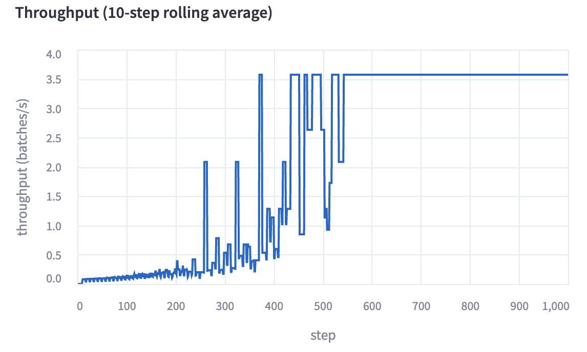
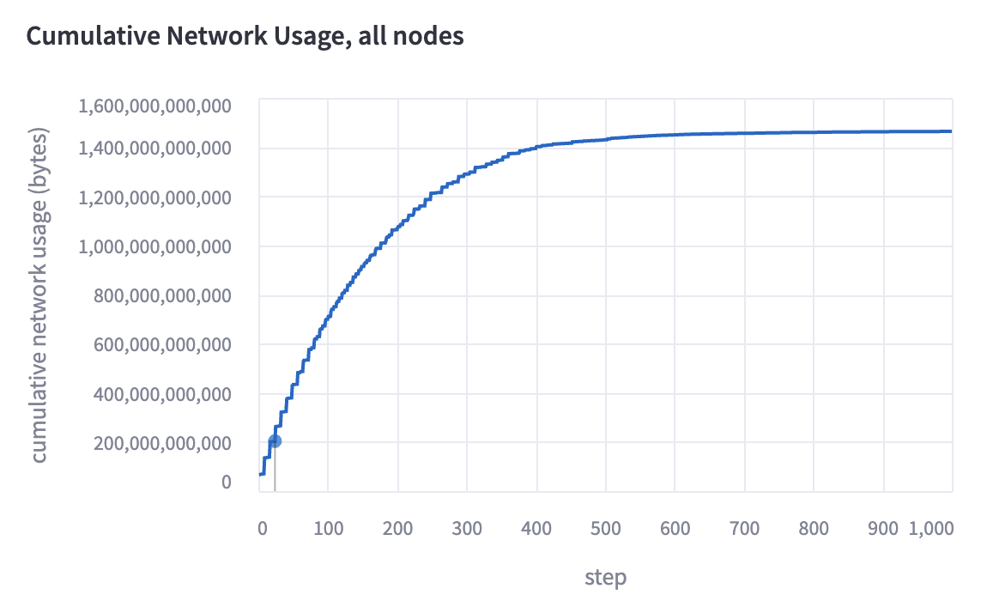
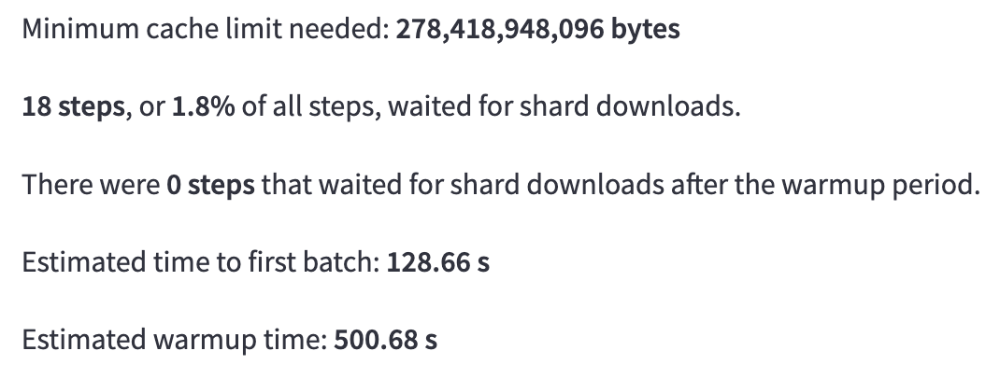

# 🤖 Streaming Simulator
A simulator for throughput and network use with MosaicML's [Streaming](https://github.com/mosaicml/streaming). The simulator allows you to:
- Plan runs and anticipate issues beforehand
- Find optimal run configurations
- Debug issues with underperforming runs
- Better understand the impact of different configurations

## 🚀 Getting Started
Run the commands below to get simulating!
```
git clone https://github.com/mosaicml/streaming.git
cd streaming
pip install ".[simulator]"
make simulator
```
## 🔑 Key Features

### Throughput
Throughput is estimated for the duration of the run and is displayed as the simulation progresses. We estimate throughput by iterating over the samples of the dataset in order, and performing shard downloads based on an estimate of network bandwidth. The 10-step rolling average is displayed.



### Network Downloads
Cumulative network downloads are also estimated for the run and displayed. It is calculated in conjunction with throughput. If shards are compressed, we assume they are downloaded in compressed form and immediately uncompressed.



### Simulation Stats
We also provide various useful statistics from the simulation, such as:
- Minimum cache limit (i.e., maximum space used by live shards)
- Steps slowed down by shard downloads
- Estimated time to first batch
- Estimated warmup time (i.e., time until throughput maximized)



### Shuffle Quality
You can choose to evaluate the quality of different shuffling algorithms for your run. We provide an estimate of shuffle quality based on the entropy calculated over the probability distribution of differences between neighboring sample indices and shard indices of the dataset. *These shuffle quality metrics are noisy and may not reflect the true strength of a shuffle.*


### Yaml Support
Yaml files that follow MosaicML conventions can be uploaded and simulated as well. Simply click the toggle, enter any needed additional information, and see your results. Parameters can also be modified to quickly test out configurations.


## 💬 Contact
If you have problems, questions, or suggestions, please reach out to the MosaicML team on our [community slack channel](https://mosaicml.me/slack).
